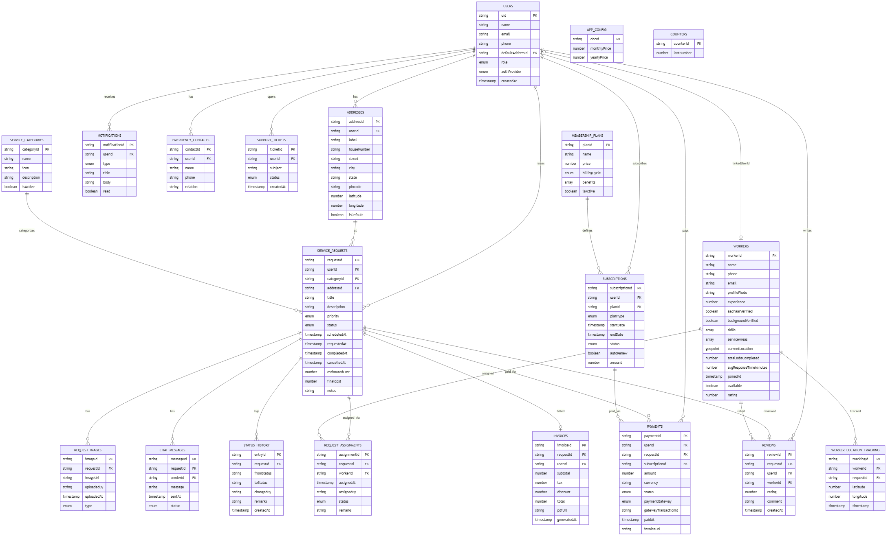
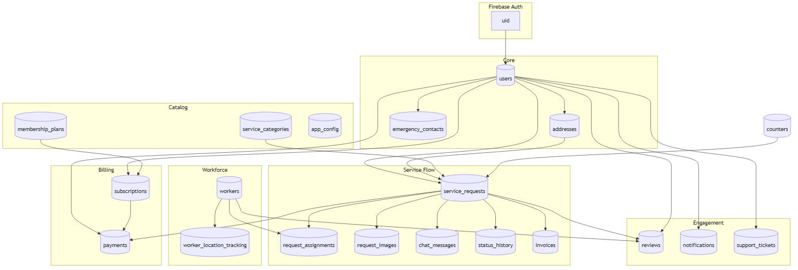
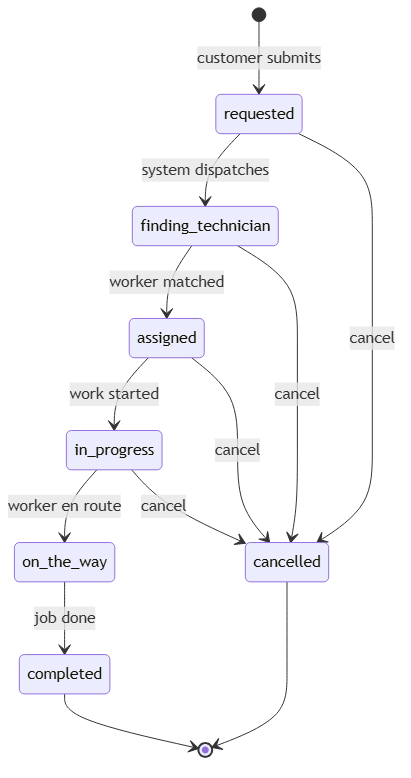

# NIVASA — Database ER Diagram (v2 Production)

**Schema version:** 2.0 · **20 collections**  
**See also:** [database-schema.md](./database-schema.md)

---

## View live diagrams

Open **[database-er-diagram.html](./database-er-diagram.html)** in your browser.

---

## 1. Full Entity Relationship Diagram (v2)

**Collections included:** users, addresses, service_categories, service_requests, request_assignments, request_images, chat_messages, status_history, workers, worker_location_tracking, reviews, payments, invoices, subscriptions, membership_plans, emergency_contacts, support_tickets, notifications, app_config, counters

---

## 2. Architecture Overview

---

## 3. Service Request Lifecycle

---

## Key v2 changes (from MVP feedback)

| Issue fixed | Solution |
|-------------|----------|
| Users missing address | `addresses` collection (1:N per user) |
| Weak service_requests | Added title, description, addressId, costs, timestamps |
| status_history missing requestId | `requestId` FK + changedBy + remarks |
| reviews missing userId | `userId` FK + comment + createdAt |
| weak workers profile | Full KYC, skills, location, jobs stats |
| subscription userId as PK | `subscriptionId` PK, `userId` FK (multiple subs) |
| no assignments history | `request_assignments` table |
| no chat / images / invoices | `chat_messages`, `request_images`, `invoices` |
| hardcoded categories | `service_categories` collection |
| no membership plans | `membership_plans` collection |
| no emergency contacts | `emergency_contacts` collection |
| no support tickets | `support_tickets` collection |
| no live tracking | `worker_location_tracking` collection |

---

## Relationship summary

| From | To | Card | Key |
|------|-----|------|-----|
| users | addresses | 1:N | userId |
| users | service_requests | 1:N | userId |
| users | subscriptions | 1:N | userId |
| users | reviews | 1:N | userId |
| addresses | service_requests | 1:N | addressId |
| service_categories | service_requests | 1:N | categoryId |
| service_requests | request_assignments | 1:N | requestId |
| service_requests | request_images | 1:N | requestId |
| service_requests | chat_messages | 1:N | requestId |
| service_requests | status_history | 1:N | requestId |
| service_requests | invoices | 1:1 | requestId |
| service_requests | reviews | 1:1 | requestId |
| workers | request_assignments | 1:N | workerId |
| membership_plans | subscriptions | 1:N | planId |

---

## Diagram files

| File | Description |
|------|-------------|
| [diagrams/er-diagram.png](./diagrams/er-diagram.png) | Full v2 ER diagram |
| [diagrams/architecture-flow.png](./diagrams/architecture-flow.png) | System architecture |
| [diagrams/request-lifecycle.png](./diagrams/request-lifecycle.png) | Ticket status flow |
| [diagrams/er-diagram.mmd](./diagrams/er-diagram.mmd) | Editable Mermaid source |
