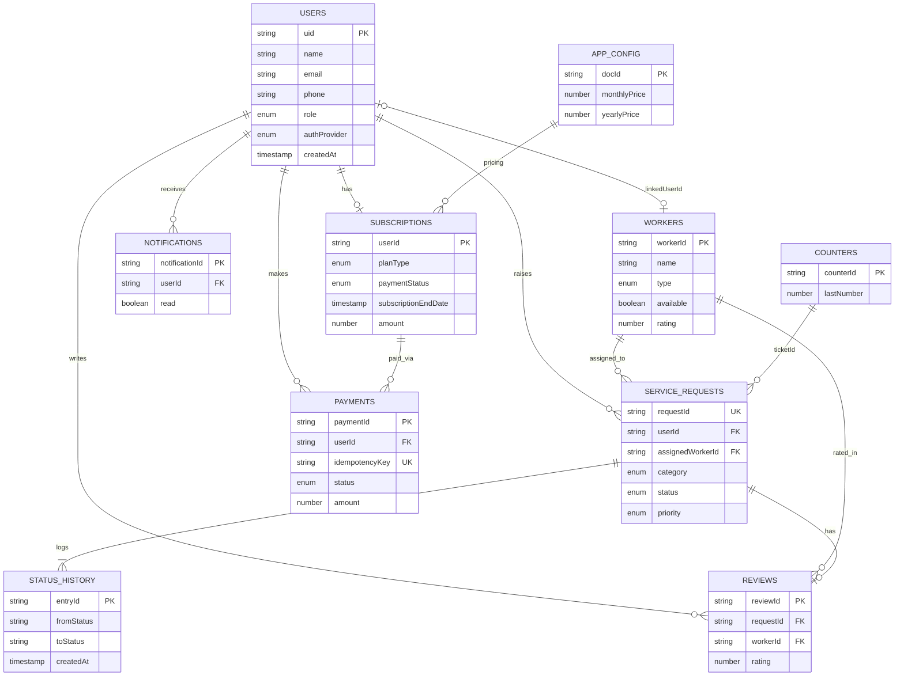
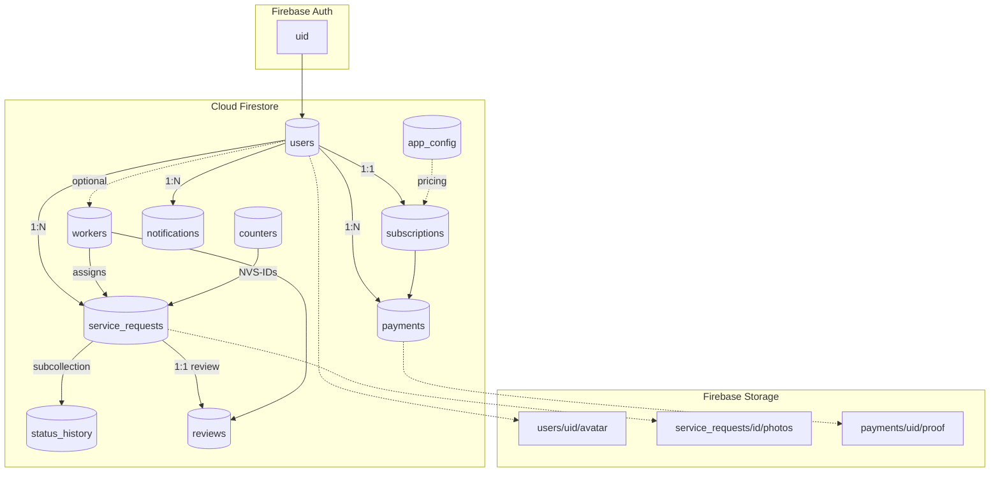
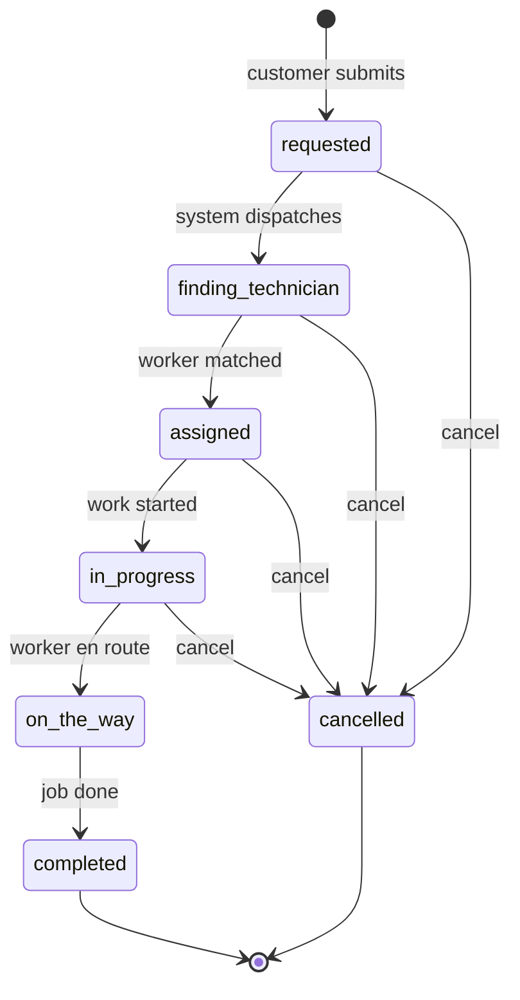

# NIVASA — Database ER Diagram

**Backend:** Cloud Firestore (NoSQL)  
**Schema version:** 1.0  
**See also:** [database-schema.md](./database-schema.md)

---

## View live diagrams (recommended)

Open **[database-er-diagram.html](./database-er-diagram.html)** in your browser — all diagrams render interactively with zoom and dark theme.

---

## 1. Entity Relationship Diagram

Mermaid source (for editors that support preview)

---

## 2. Architecture Overview

Mermaid source

---

## 3. Service Request Lifecycle

Mermaid source

---

## Relationship summary

| From | To | Cardinality | Join key |
|------|-----|-------------|----------|
| `users` | `subscriptions` | 1 : 1 | `users.uid` = `subscriptions.userId` |
| `users` | `service_requests` | 1 : N | `users.uid` = `service_requests.userId` |
| `users` | `payments` | 1 : N | `users.uid` = `payments.userId` |
| `users` | `notifications` | 1 : N | `users.uid` = `notifications.userId` |
| `users` | `reviews` | 1 : N | `users.uid` = `reviews.userId` |
| `users` | `workers` | 0 : 1 | `users.uid` = `workers.linkedUserId` |
| `workers` | `service_requests` | 1 : N | `workers.workerId` = `service_requests.assignedWorkerId` |
| `workers` | `reviews` | 1 : N | `workers.workerId` = `reviews.workerId` |
| `service_requests` | `status_history` | 1 : N | subcollection under request doc |
| `service_requests` | `reviews` | 1 : 0..1 | `service_requests.requestId` = `reviews.requestId` |
| `subscriptions` | `payments` | 1 : N | `subscriptions.userId` = `payments.subscriptionId` |

---

## Diagram files

| File | Format | Description |
|------|--------|-------------|
| [database-er-diagram.html](./database-er-diagram.html) | HTML | **Open in browser** — live interactive diagrams |
| [diagrams/er-diagram.png](./diagrams/er-diagram.png) | PNG | Entity relationship diagram |
| [diagrams/architecture-flow.png](./diagrams/architecture-flow.png) | PNG | System architecture |
| [diagrams/request-lifecycle.png](./diagrams/request-lifecycle.png) | PNG | Ticket status flow |
| [diagrams/*.mmd](./diagrams/) | Mermaid | Source files (editable) |

---

## Legend

| Symbol | Meaning |
|--------|---------|
| **PK** | Primary key / document ID |
| **FK** | Foreign key (logical reference) |
| **UK** | Unique key |
| **1:1** | One document per user |
| **1:N** | One-to-many |
| **subcollection** | Nested under parent document in Firestore |
